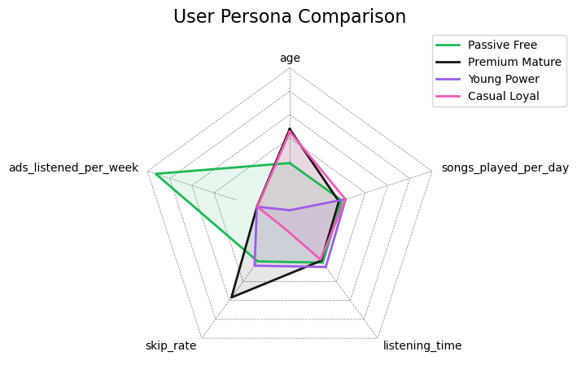

## Spotify Churn & Revenue Risk Analysis

### Summary
This project analyzes the 2025 [Spotify user dataset](www.kaggle.com/datasets/nabihazahid/spotify-dataset-for-churn-analysis) to identify behavioral segments with the goal of predicting user churn. While traditional classification methods showed low predictive lift (AUC 0.51), unsupervised learning (PCA + K-Means) revealed an "at risk of revenue loss" segment - The Premium Mature Listener.

To quantify the business impact, a Monte Carlo simulation was implemented, which identified approximately $6.3k/month in terms of revenue risk for this specific cohort, which could provide actionable insights for retention-focused teams. 

##

### Key Insights & Business Recommendations
- **"Value Gap" for Older Users**: Cluster 1 - Premium Mature (average age 46) are users on paid tiers but exhibited highest churn rate (27.5%) and highest skip rates. This could be due to the recommendation algorithm being biased toward younger demographics.
- **Recommendation Interventions to target 2 groups of users over 40**: 
    - Onboarding for new users: Improved preference-profiling of new users via updated onboarding flow,
    - Existing users: "Reset algorithm" feature specifically for users who consecutively skipped more than a predefined threshold of songs.
- **Revenue at Risk**: Stoachstic modeling showed that just purely based on random chance of churn within the at-risk Cluster 1 users could lead to a revenue swing of ±$500/month, adding up over time if not addressed.

##

### Tech Stack
- **Analysis**: Python (Pandas, NumPy, Scikit-Learn)
- **Dimensionality Reduction**: PCA (Principal Component Analysis)
- **Clustering**: K-Means (Optimized via Elbow/Knee Method & Silhouette Score)
- **Risk Modeling**: Monte Carlo Simulation
- **Visualization**: Matplotlib, Seaborn

##

### Methodology
1\. **Exploratory Data Analysis (EDA) & Data Preprocessing**
-  Identification of Churn vs No-Churn class imbalance.
- Conversion of categorical data to one-hot encoded variables & normalization of numerical variables.

2\. **Segmentation (PCA + K-Means)**
- PCA was used to reduce 24 components to 9 components (80% variance explained).
- K-Means clustering was performed for 4 clusters (`k=4`):
    - Cluster 0: Passive Free Users, Ad-Tolerant
    - Cluster 1: Premium Mature Users, At-Risk (High Skips, Low Engagement)
    - Cluster 2: Young Power Users (Price Sensitive)
    - Cluster 3: Casual but Loyal Users (Low Maintenance)

3\. **Classification (Random Forest)**
- Initial modeling with Random Forest yielded AUC of 0.51.
- Churn in this dataset (with only a limited number of user behavior related features) is likely event-driven e.g. via competitor pricing, rather than behavior-driven.

4\. **Financial Risk Modeling**
- Focusing on the identified "most at-risk" cluster of users (Cluster 1 - Premium Mature) with a probability of churn of 27.5%, the Monte Carlo method was used to simulate 10,000 possible churn outcomes to observe the distribution of revenue lost if left unaddressed.

##

### Limitations & Future Work
- **Missing Temporal Data**: The data is a snapshot of a period in 2025, which means we only see a user's behavior at that point in time. Future work with more data could incorporate time-series analysis to see how a user's behavior changes and if a pattern emerges leading to churn.
- **External Factors**: Other factors e.g. competitor data or app performance logs could better help explain churn behavior.
- **Hard Clustering**: K-Means assigns users to exactly one group but in reality users could belong to multiple groups. Using Gaussian Mixture Models (GMMs) could better capture such users.
